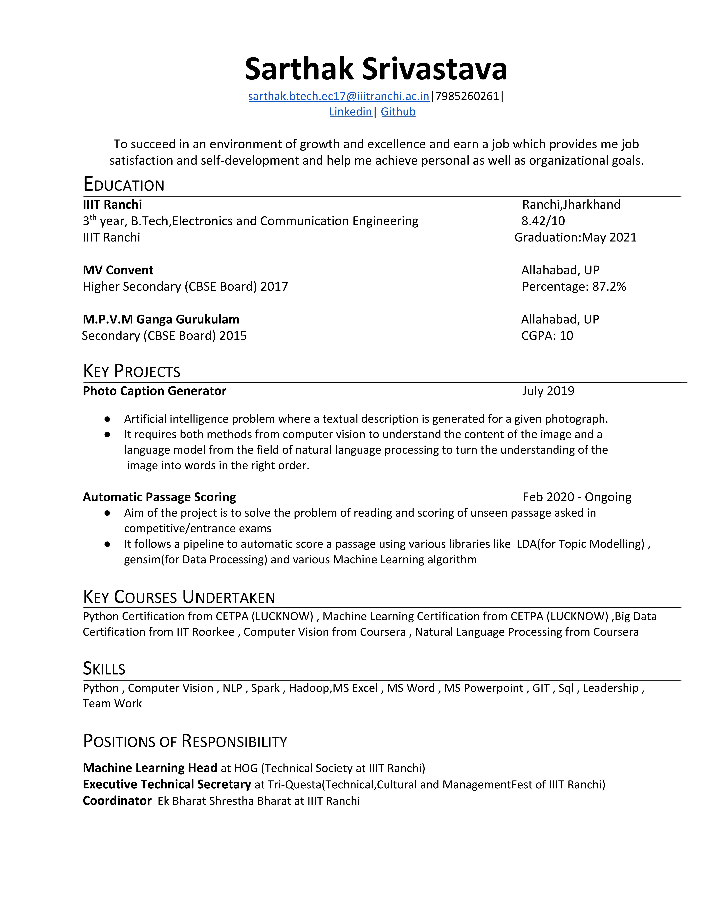
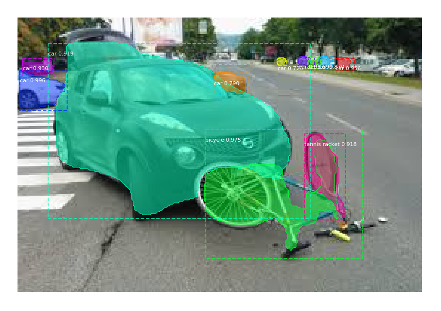
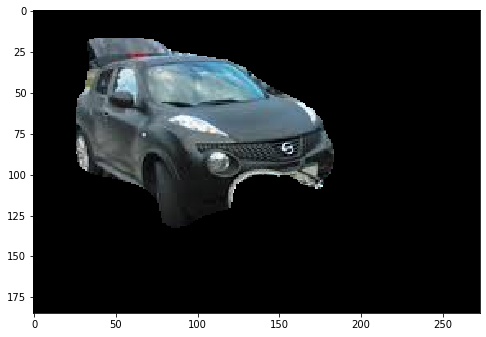

**Extraction content of PDF , image in any format using OCR(Optical Character Recognition) .  Image Segmentation enables to extract objects from images and images from pdf.**

Using OCR extrasting the pages of resume and converting into images

Using Image Segmentation techniques to extract individual objects from image

